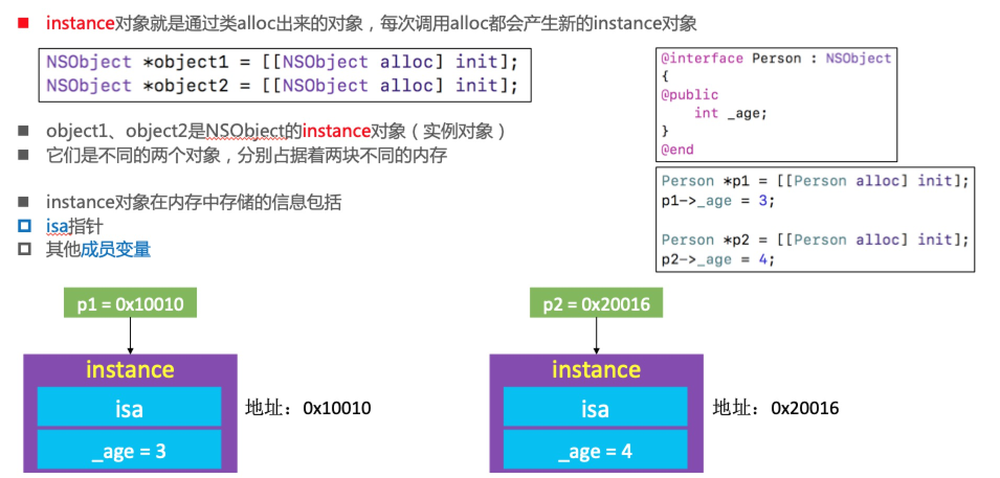
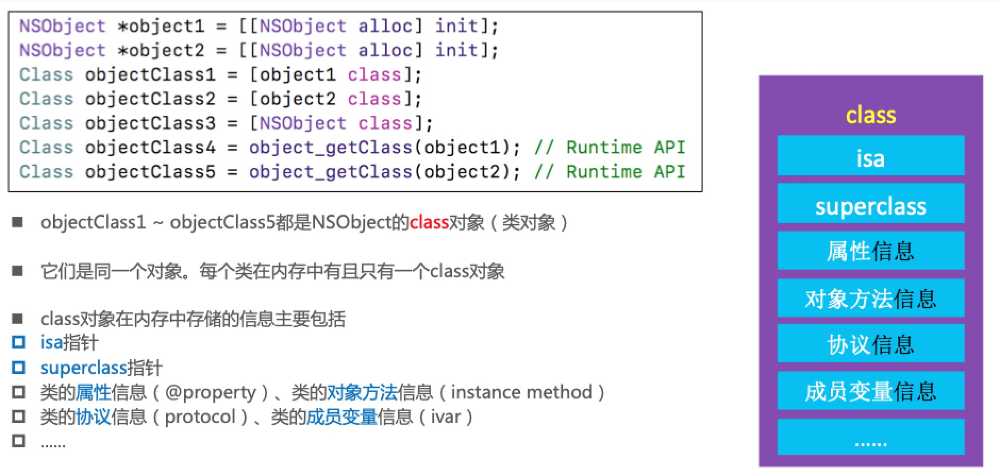
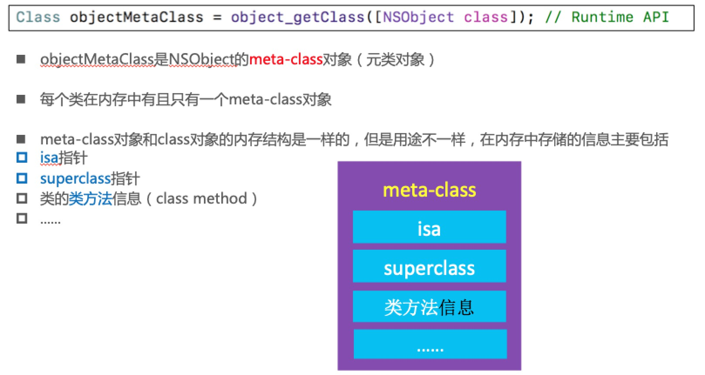

### 1、OC对象的本质
#### 1.1 我们平时编写的Objective-C代码，底层实现其实都是C\C++代码。Objective-C的对象、类主要是基于C\C++的结构体实现

>OC -> C/C++ -> 汇编语言 -> 机器语言

#### 1.2 将Objective-C代码转换为C\C++代码

>xcrun  -sdk  iphoneos  clang  -arch  arm64  -rewrite-objc  OC源文件  -o  输出的CPP文件。
>
>如果需要链接其他框架，使用-framework参数。比如-framework UIKit

#### 1.3 NSObject的底层实现


#### 1.4 实时查看内存数据

#### workflow

#### LLDB指令

>print、p：打印
>po：打印对象
>
>读取内存
>memory read/数量格式字节数  内存地址
>x/数量格式字节数  内存地址
>x/3xw  0x10010
>
>格式
>x是16进制
>f是浮点
>d是10进制
>
>字节大小
>b：byte 1字节
>h：half word 2字节
>w：word 4字节
>g：giant word 8字节
>
>修改内存中的值
>memory  write  内存地址  数值
>memory  write  0x0000010  10

#### 1.5 结构体内存分配

[结构体大小计算](http://www.cnblogs.com/xieyajie/p/8094788.html)

#### 1.6 sizeof注意点

sizeof是编译器特性，在编译的时候直接进行常理替换，并不是函数。class_getInstanceSize需要在运行时确定大小。

### 面试题

* 1.1一个NSObject对象占用多少内存？

```
 NSObject *obj = [[NSObject alloc] init];
// 16个字节
    
// 获得NSObject实例对象的成员变量所占用的大小 =8
NSLog(@"%zd", class_getInstanceSize([NSObject class]));//8
    
// 系统分配了16个字节给NSObject对象
//CF requires all objects be at least 16 bytes
NSLog(@"%zd", malloc_size((__bridge const void *)obj));//16

苹果系统分配内存源码
https://opensource.apple.com/tarballs/libmalloc/
malloc.c/calloc  Buckets sized {16,32,64,80,96,112,...}
操作系统分配内存也有对齐，16的整数倍

创建一个实例对象，至少需要多少内存？//结构体内存对齐
#import <objc/runtime.h>
class_getInstanceSize([NSObject class]);

建一个实例对象，实际上分配了多少内存？//操作系统分配内存也会对齐，16的整数倍
#import <malloc/malloc.h>
malloc_size((__bridge const void *)obj);

sizeof()也能计算出大小

gnu（glibc/malloc/MALLOC_ALIGNMENT=16 c语言源码）是一个开源组织也提供了相关源码

```

### 2、OC对象的分类
#### 2.1 Objective-C中的对象，简称OC对象，主要可以分为3种

* instance对象（实例对象）
* class对象（类对象）
* meta-class对象（元类对象） 

#### instance

#### class

#### meta-class

