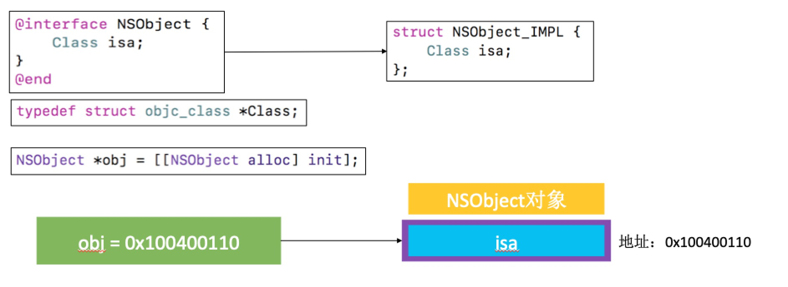
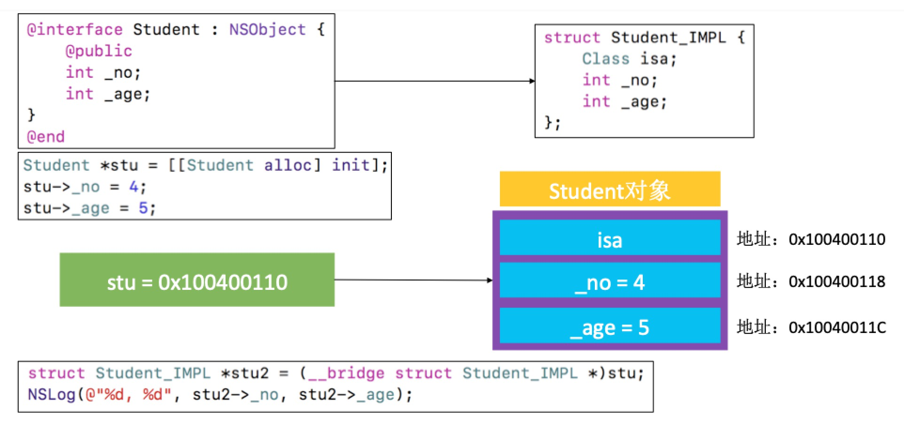
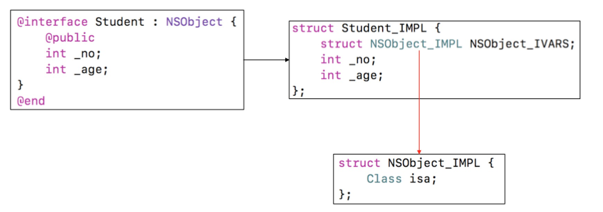
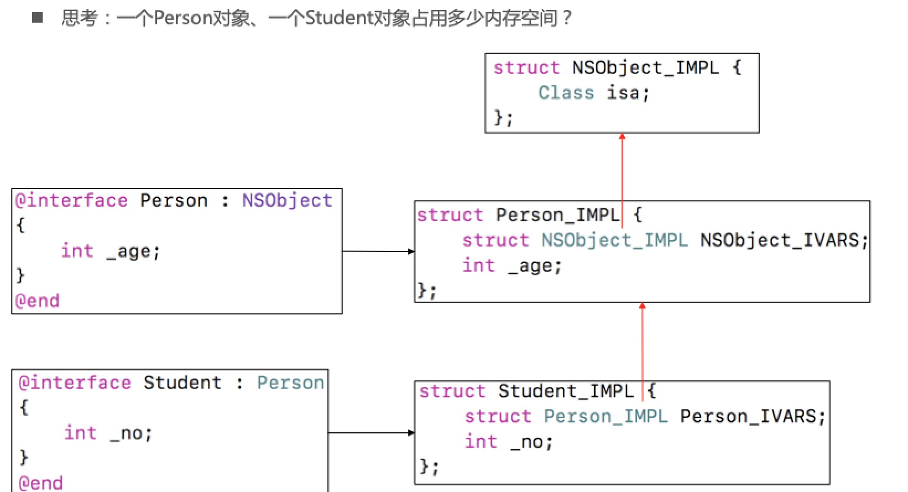
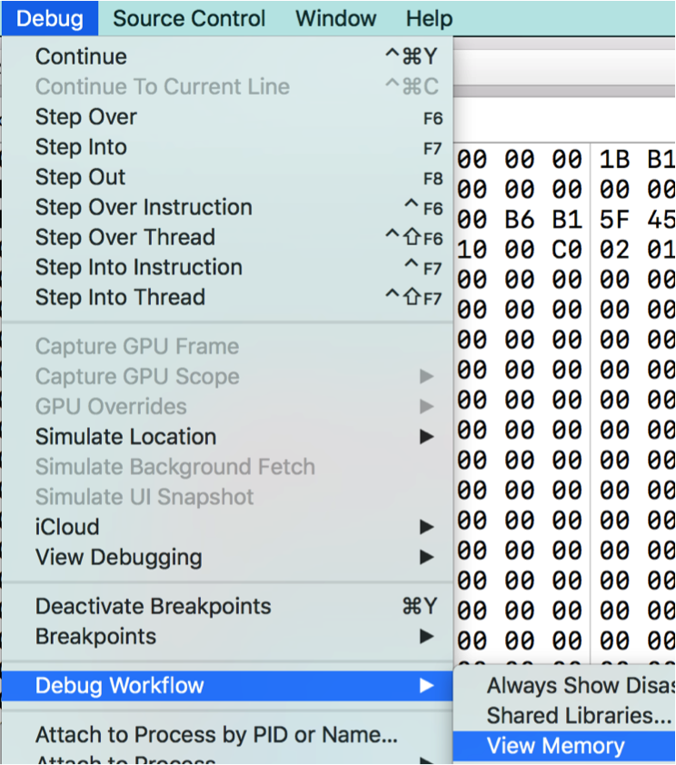

### 1、OC对象的本质
* 1.1 我们平时编写的Objective-C代码，底层实现其实都是C\C++代码。Objective-C的对象、类主要是基于C\C++的结构体实现

>OC -> C/C++ -> 汇编语言 -> 机器语言

* 1.2 将Objective-C代码转换为C\C++代码

>xcrun  -sdk  iphoneos  clang  -arch  arm64  -rewrite-objc  OC源文件  -o  输出的CPP文件。
>
>如果需要链接其他框架，使用-framework参数。比如-framework UIKit

* 1.3 NSObject的底层实现






* 1.4 实时查看内存数据

#### workflow

#### LLDB指令

>print、p：打印
>po：打印对象
>
>读取内存
>memory read/数量格式字节数  内存地址
>x/数量格式字节数  内存地址
>x/3xw  0x10010
>
>格式
>x是16进制
>f是浮点
>d是10进制
>
>字节大小
>b：byte 1字节
>h：half word 2字节
>w：word 4字节
>g：giant word 8字节
>
>修改内存中的值
>memory  write  内存地址  数值
>memory  write  0x0000010  10


### 面试题

* 1.1一个NSObject对象占用多少内存？

```
 NSObject *obj = [[NSObject alloc] init];
// 16个字节
    
// 获得NSObject实例对象的成员变量所占用的大小 =8
NSLog(@"%zd", class_getInstanceSize([NSObject class]));//8
    
// 系统分配了16个字节给NSObject对象
//CF requires all objects be at least 16 bytes
NSLog(@"%zd", malloc_size((__bridge const void *)obj));//16
    
```


