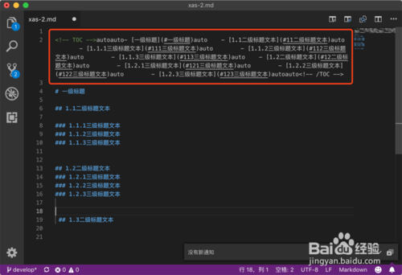
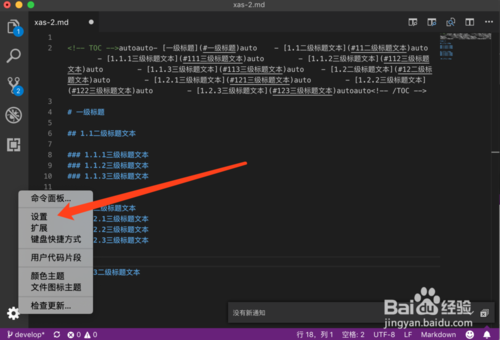
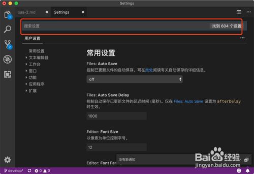
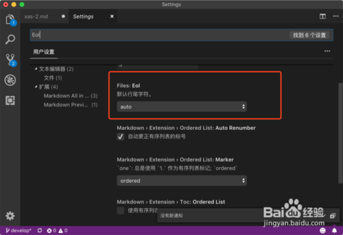
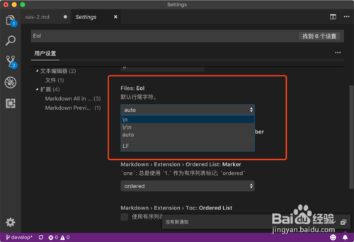

* 1、更新VSCode之后打开已经生成目录的Markdown文件，TOC标签格式异常出现如下auto的文字。

* 2、点击界面左下方的设置按钮，然后选择设置进入到用户设置界面。

* 3、打开用户设置之后在搜索设置里面搜索Eol。

* 4、找到文件的Eol可以看到默认行尾字符设置为auto。

* 5、点击选项框然后将auto更改为\n换行符即可。

* 6、回到Markdown编辑界面然后重新生成Markdown目录就能显示正常了。