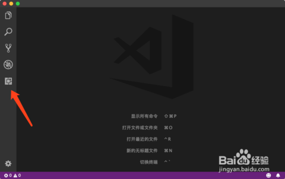
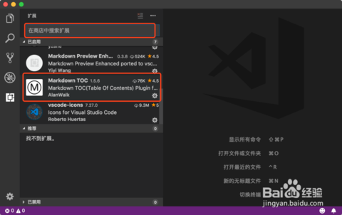
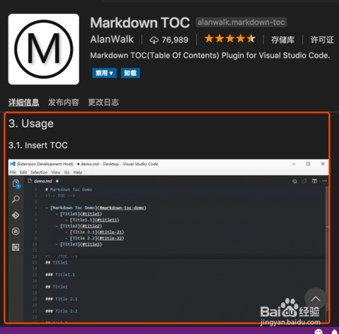
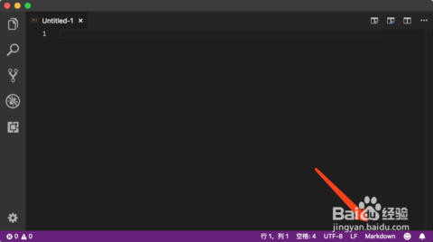
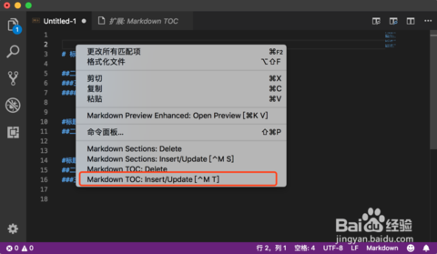
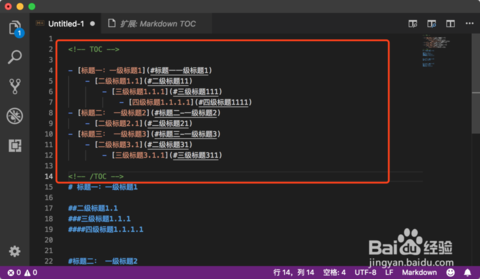

* 1、这里使用VSCode来实现，首先我们在电脑上安装好VSCode，具体的安装方式不用多说，然后打开选择侧边栏的扩展按钮。   

* 2、在扩展搜索栏搜索Markdown TOC的扩展，点击查看进行安装。

* 3、在详细信息描述处我们可以查看该扩展的基本使用，一般会有个基本的使用演示说明。

* 4、新建一个文件，选择语言格式为Markdown，如果没有该语言格式选择可以根据提示下载。
  

* 5、在Markdown文件中编辑一些示例的一级和二级等标题，然后在需要生成目录的地方鼠标右键选择刚才安装的扩展功能，Markdown TOC:Insert/Update。

* 6、扩展会根据目录结构自动生成TOC标签目录结构，说明下如果出现目录生成不完整的情况可能是因为文件太大，可以将后面无法生成目录的内容拷贝到新的Markdown文件中再生成，接着将目录复制到一起就可以。

